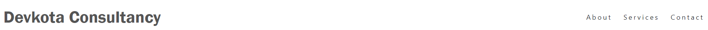
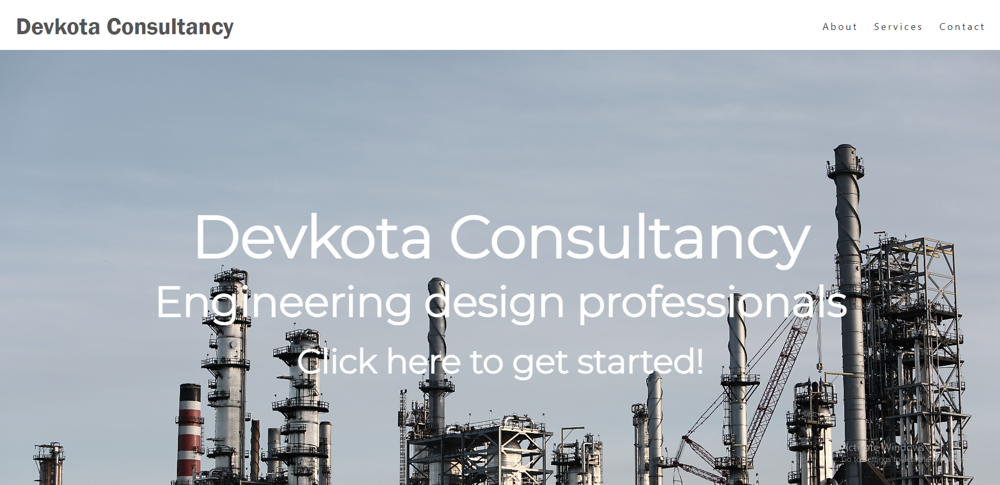
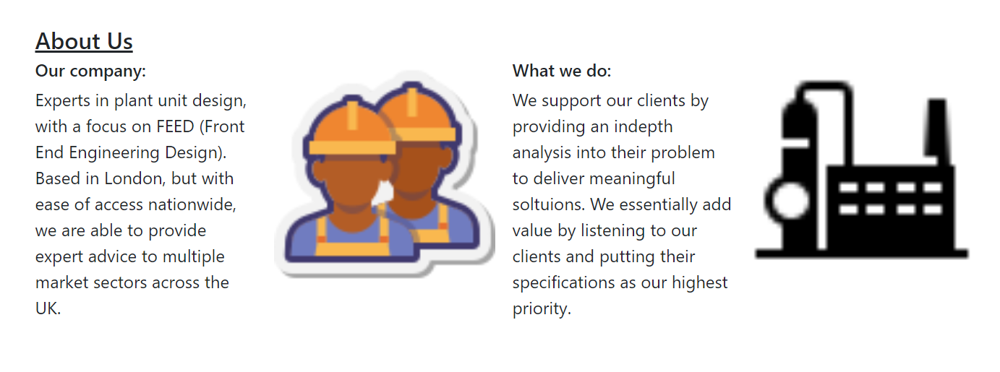
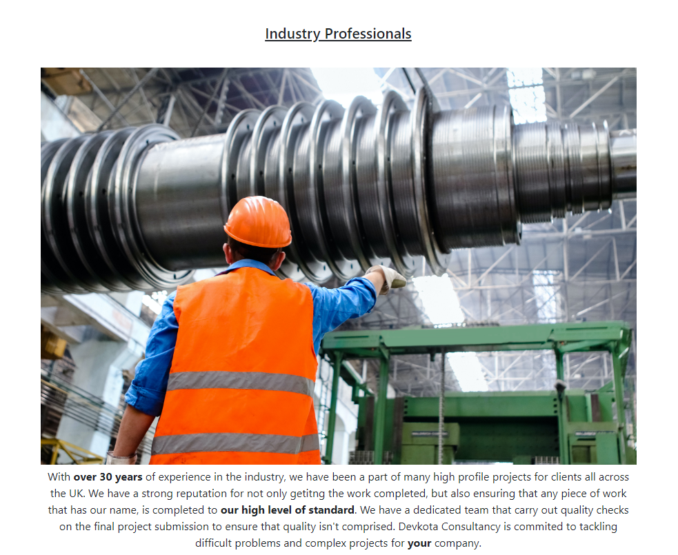
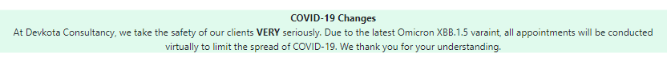
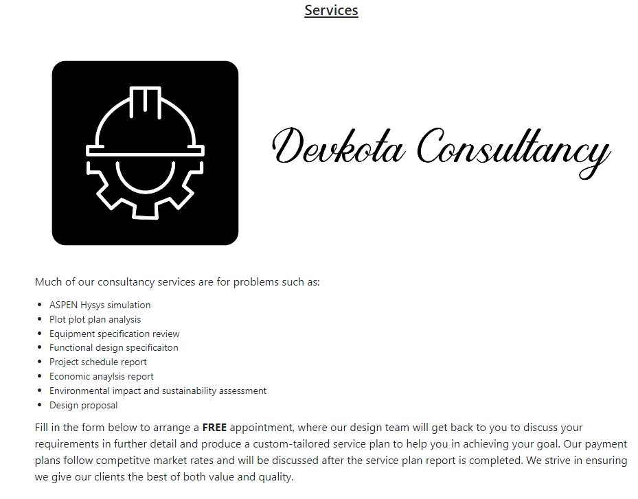
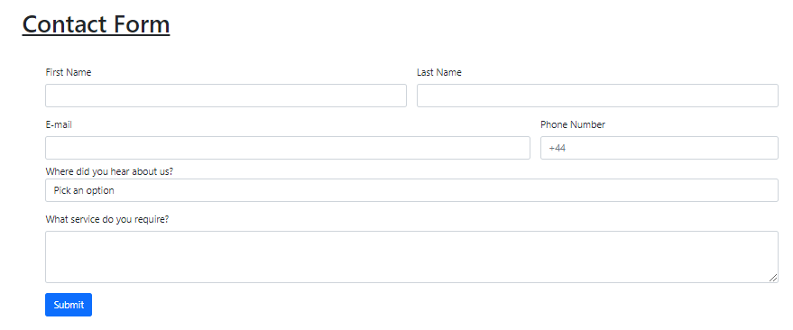
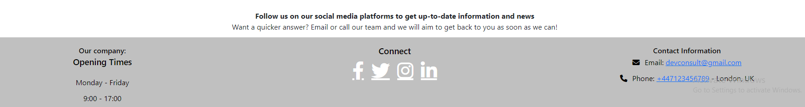
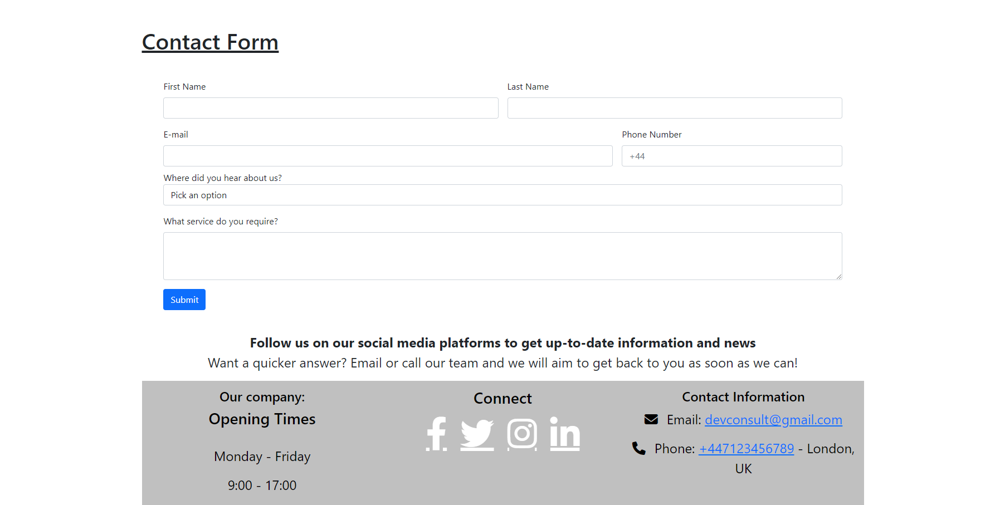
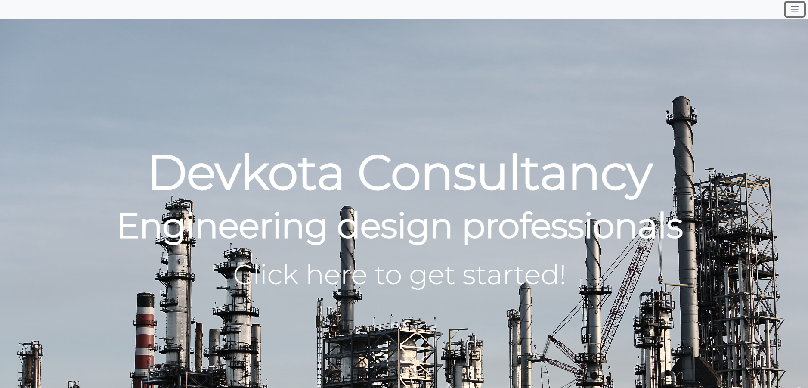

# Devkota Consultancy: Chemical Engineering Design Consultancy Comapny

This website was created for the 1st Milestone Project at the Code Institute's Diploma course in Software Development.

The aim of the website was to create a chemical engineering design consutlancy company, based in the UK, that focuses on the FEED (Front End Engineering Design) aspect of consultancy. In order to make the website seem and feel real, I've created a nice and wide intial landing page to welcome the user, with 3 additional sections to add depth into the website. Within the footer section, I've added the comapny's social media profiles so the user can keep up-to-date with the company. Adding a social aspect to the website also builds trust and bonding with the user.

To visit the website, [click here.](https://tomes2000.github.io/devkota_consultancy/)

# Table of Contents
- [UX and UI](#ux-and-ui)
  * [Project Information](#project-information)
  * [User Experience](#user-experience)
  * [User Stories](#user-stories)
  * [Target user](#target-user)
  * [Site Owner Goals](#site-owner-goals)
  * [Design](#design)
  * [Wireframes](#wireframes)
  * [Typography](#typography)
  * [Colour Palette](#colour-palette)
  * [Favicon](#favicon)
  * [Imagery](#imagery)
  * [Logo](#logo)
  * [Implemented Features](#implemented-features)
  * [Future Feature Implementation Plan](#future-feature-implementation-plan)
  * [Technologies Implemented](#technologies-implemented)
- [Testing](#testing)
  * [Manual Testing](#manual-testing)
  * [Validation Testing](#validation-testing)
  * [Bug fixes](#bug-fixes)
  * [User Stories Implementation](#user-stories-implementation)
- [Deployment](#deployment)
  * [Forking a GitHub Repository](#forking-a-github-repository)
  * [Cloning a Repository Using The Command Line](#cloning-a-repository-using-the-command-line)
  * [Credits](#credits)
  * [Code](#code)
  * [Imagery](#imagery-1)
  * [Acknowledgements](#acknowledgements)

<small><i><a href='http://ecotrust-canada.github.io/markdown-toc/'>Table of contents generated with markdown-toc</a></i></small>


# UX and UI
* ## Project Information
  Having completed a BEng in Chemical Engineering that focuses on the FEED (Front End Engineering Design) aspect of chemical engineering, I have a good understanding on this subject matter and what services are required in order to set up a chemical engineering plant within the UK.

* ## User Experience
  * ## User Stories
    As a user: 
    1. I want to be able to easily navigate the website.
    2. I want to be able to find out if this company has conducted work in the past.
    3. I want to see what services are on offer.
    4. I want to know how I can be able to find out the cost of said services.
    5. I want a way in which I can contact the company in order to discuss the services in further detail.
    6. I want to be able to socially connect with the company and keep up-to-date with their news and stories.
   
   * ## Target user
   The target user for this kind of service is a company who requires help with small to medium sized projects within the UK. They should require high quality solutions, as we are a high quality business, with competitve market rates, specialising in the FEED (Front End Engineering Design) aspect of chemical engineering.
   
* ## Site Owner Goals
1. Increase customer interaction with the comapny.
2. Create brand recognition.
3. Increase amount of user call/emails to the the company.
4. Increase sales revenue for services.
   
* ## Design
     * ## Wireframes
     To access the wireframe images, click here.
     * ## Typography
     In order to make the logo bold, I went with Franklin Gothic Medium, For the landing text, I wanted to make it look opulent therefore I went with the Italiana          font. The bold logo at the top and the finely-put-together landing text compliment each other very well. I kept the body the default font as it ties in well            with my idea of a simple website.
     * ## Colour Palette
     Using the [Coolors](https://coolors.co/) website to generate a colour palette, I decided to use a simple theme throughout my website so that I didn't                overload the user's visual senses. I decided to slightly change the colour tones of some of the colour palette suggestions so that they blended better together. I      used  the colour palette more as a guide to further ideas. The colours used on my website are: #e0faed, white, #d5d5d5, #fff, black, #777777 and #555555.
     * ## Favicon 
     Using [Favicon.io](https://favicon.io/) to generate a favicon image for my website, I managed to give it a simple feel that matches the fung shui and vibe of the      whole website. Using the same colours I used in my logo, it really blends everything very well.
    * ## Imagery
    All imagery was sourced from the website, [Pexels.](https://www.pexels.com/)
   
    The images I've chosen in my website give a nice and professional look, whilst also keeping the website nice and simple. All images that are next to accompanying text     have a connection to them, which aids the user in better understanding the purpose of the website. The simple look of the website works well with the massive hero     image in the landing section that is meant to attract the users attention.
    * ## Logo
    The Devkota Consultancy logo was generated from the website  [my free logo maker.](https://myfreelogomaker.com/onboarding)
   
    To keep up with the professional and simple look of my website, my logo is very simple and just has the colour black with a basic engineering image to the left of     the text. 
   
* ## Implemented Features 
  * Navigation bar - This is at the top of the page, consisting of the About, Services and Contact section. When any of these sections are hovered over, a 1px solid #777777 line is shown to showcase to the user that they're about to navigate towards that section of the page. The background of the navbar is white which works well with the #555555 colour of the logo. The navbar is fully functional at smaller screen sizes for mobile users as well.
   
   
   
   
  * Landing page - Containing the hero image, which covers the majority of the screen to grab the user's attention, and hero text which prompts the user to explore further into the website. The text has the company's name, a summary of what the company does and an option to invite the user to explore the website with a "click here to get started!" section. When this section is clicked, the user is directed to the services section which is designed to showcase all the services offered by the company.

  
  
  * About us - Containing 2 paragraph sections and 2 image sections, this part of the website introduces the user to the company. The two images featured are of chemical engineers and a chemical engineering plant unit item. Both images are relevant to the text and help the user in gaining a deeper understanding of the company. When about is selected on the navigation bar, this section will appear. 
   
  
  
  * Further about - The further about section consists of an image with text below it. The reason I've added a further about section is to re-inforce trust with the client by showcasing that this comapny has a many years experience within the industry and therefore can be trusted. In addition to this, by including the company's quality guarantee, it showcases to the client that we take quality VERY seriously. The image is meant to represent a fictional person, partaking in a fictional project for our fictional consultancy.

  
  
  * Spacer image - The purpose of the spacer image is to create a break between the about section and the services section. In additon to this, the image is also meant to make the website more visually appealing so that it's not too simple, thus helping it to not be perceived as boring.
  
  
  
  * COVID banner - In light of the new COVID-19 variant recently, I have added the banner in order to showcase to clients that we care about them, but also to bring the website to life to give the vibe that it's real.

   
   
  * Services - The services section consists of the comapnies logo with text outlining what services are on offer. Since chemical engineering services vary with the type of project, an exact pricing list isn't used. Instead a pricing report is created by booking an appointment with the design team. When services is selected on the navigation bar, this section will appear.
  
   
   
  * Contact form - The contact form allows the user to book an appointment by submitting their contact details in; the user can also add how they heard about the company. Furthermore, there is a section which allows the user to add input into the form to convey messages to the design team. This allows the design team to get a sense of what services the user requires and gives them a chance to prepare documents before the appointment with the client. When contact is selected on the navigation bar, this section will appear.
  
   
  
  * Footer - The footer contains the company's contact phone, email, opening dates, opening times and social media links. All social media links open in a new tab.
  
   
   
* ## Future Feature Implementation Plan

  * An automatic event booking calendar system that notifies the design team of the client's availability. This would save time and money for the company as it makes the process of contacting the client back more streamlined.
  * A hamburger style navigation bar was previously added in, however wouldn't show on the website due to the hero image being in the background; causing it to completely cover the navbar menu options. A workaround to this issue would be useful to make the website more appealing to tablet users, due to the awkward placement of the navigation options. 
  * An interactive menu that displays the services provided by the company than just a plain list.

* ## Technologies Implemented
  
  * Languages
    * HTML5
    * CSS
  * Frameworks and Libraries
    * [VS Code](https://code.visualstudio.com/)
    * [Bootstrap 5](https://getbootstrap.com/docs/5.0/getting-started/introduction/)
    * [Favicon](https://favicon.io)
    * [Google Fonts](https://fonts.google.com/)
    * [Coolors](https://coolors.co)
    * [Balsamiq](https://balsamiq.com/)
    * [Am I Responsive](http://ami.responsivedesign.is/)
    * [GitHub](https://github.com/)
    * [Font Awesome](https://fontawesome.com/)
    * [Pexels](https://www.pexels.com/)
 
* # Testing
  Using Google Chrome's inbuilt developer tools, I was able to virtually simulate different screen sizes and different phone models. In addition to this, testing was also carried out on a real iPhone 2020 using safari and no problems were found.
    * ## Manual Testing
      * Navigation
        * Verify all navigation links direct the user to the appropriate section within the website.
        * Verify that the navigation link has a line below it when it is hovered over to indicate to the user their selection choice.
        * Verify that the navigation links are fully functioning on mobile devices and smaller screen sizes.
      * Footer
        * Verify that the phone number link is dialled when selected.
        * Verify that the email link prepares a draft email to send when selected.
        * Verify all social media links work and open in a new tab.
      * Hero text
        * Verify that the "click here to get started!" button works and redirects the user to the correct section within the webpage. 
      * Contact Form
        * Verify that the contact form works and the "submit" button directs the user back to the landing page at the top of the website.
        * Verify that all necessary field texts are filled in order for submition to work.
        * Verify that the email address field requires a "@" character for the submition to work.
    * ## Validation Testing
      * Tested the HTML code with [W3C HTML Validator](https://validator.w3.org/)
      * Tested the CSS code with [W3C CSS Validator](https://jigsaw.w3.org/css-validator/)
    * ## Bug fixes
      * My footer was not covering the full width of the page. I was very confused until I realised that I had forgotten to close a div tag from my form section, which was affecting my footer.
      
      
      
      * Using a bootstrap style hamburger navigation bar, I noticed that it was not displaying correctly on my webpage. This was due to the fact that the hero image was in the background and was covering the drop-down menu options. This made navigation difficult for the user. In order to resovle the issue, I opted to go with the same responsive style navigation bar that was used in Code Institute's "Love Running" project. As you can see in the image, even though the hamburger option is toggled on, the drop-down menu cannot be seen.
      
      
      
      * Initially the hero image didn't have the "click here to get started!" option. I added it in to invite the user into the website and to also ensure that the user is aware that there's more to the website than just the hero image.
      * I've added "rel-noopener" to untrusted external links outside my website in order to maintain best practices.
      * I've added "alt" tags to all my images in order to maintain accessibility and prevent discrimination towards visually-impaired users.
      
     
      
* ## User Stories Implementation 
    1. I want to be able to easily navigate the website.
       * A user can use the navbar for easy access navigation to the three sections within the website.
    2. I want to be able to find out if this company has conducted work in the past.
       * A user can navigate to the about section, which showcases the amount of years the company has been in the industry, highlighting their past experience in this line of work.
    3. I want to see what services are on offer.
       * A user can navigate to the services section, which showcases what services the company can provide.
    4. I want to know how I can be able to find out the cost of said services.
       * A user can find out the cost of their respective service plan by booking an appointment with the design team, where their needs will be discussed and a payment plan will be produced based on further information provided by the client.
    5. I want a way in which I can contact the company in order to discuss the services in further detail.
       * A user can navigate to the contact section, where they will be greeted by a form. The comapny's email address and phone number are also provided in the footer section.
    6. I want to be able to socially connect with the company and keep up-to-date with their news and stories.
       * A user can socially connect with the company with any of the social media links in the footer section.
       
* # Deployment
  I created this project using VS Code as I found it easier than using Gitpod. The site was deployed to GitHub pages. In order to deploy to GitHub pages:
  1. On the GitHub repository, select the "Settings" option.
  2. On the left sidebar, select the "Pages" tab option.
  3. Under the GitHub pages, use the branch drop-down menu and select the "deploy from a branch" option.
  4. Select the save option and then the page will refresh, showing the link to the live site.
* ## Forking a GitHub Repository
   1. Login to GitHub.
  2. Locate your desired repository.
  3. Locate the fork option in the top-right hand corner of the repository page.    
  4. You will be asked where you want to fork it to.
* ## Cloning a Repository Using The Command Line
  Taken directly from the GitHub website.
  1. On GitHub.com, navigate to the main page of the repository.
  2. Above the list of files, click download code.
  3. Copy the URL for the repository.
    To clone the repository using HTTPS, under "HTTPS", click the clipboard image.
    To clone the repository using an SSH key, including a certificate issued by your organization's SSH certificate authority, click SSH, then click the clipboard image.
    To clone a repository using GitHub CLI, click GitHub CLI, then click the clipboard image.
    4. Open Git Bash (or whatever other terminal you use).
    5. Change the current working directory to the location where you want the cloned directory.
    6. Type ```git clone```, and then paste the URL you copied earlier. 

          ```
           $ git clone https://github.com/YOUR-USERNAME/YOUR-REPOSITORY
          ```
     7. Press Enter to create your local clone.
     
         ```
         $ git clone https://github.com/YOUR-USERNAME/YOUR-REPOSITORY
         ```
         ```
         \> Cloning into \`Spoon-Knife`\...

         \> remote: Counting objects: 10, done.

         \> remote: Compressing objects: 100% (8/8), done.

         \> remove: Total 10 (delta 1), reused 10 (delta 1)

         \> Unpacking objects: 100% (10/10), done.
         ```


* ## Credits
   * ## Code
      * Bootstrap was used for the majority of this project to maiximise responsivity.
      * Credit to [W3 Schools](https://www.w3schools.com/bootstrap5/bootstrap_get_started.php) for their fantastic guide on effectively using Bootstrap 5.
      * The navigation bar was adapted from the Code Institute's Love Running project.
      * Most of the contact icons used in the footer were taken from [Font Awesome](https://fontawesome.com/).
   * ## Imagery 
      * All imagery is taken from [Pexels](https://www.pexels.com/).
   * ## Acknowledgements
      * A big thank you to Guido Cecilio for his motivation as my mentor.
      * Credit to Maggie Walsh for her README.md which I've used as guide for mine.
        
